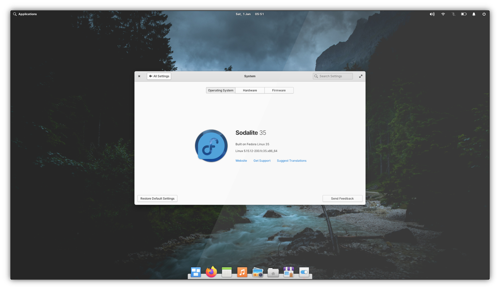

# Sodalite

## Quickstart

You better know what you're doing, sparky. To get going:

1) Install an OSTree version of Fedora, such as [Fedora Silverblue](https://silverblue.fedoraproject.org/).
2) Run `wget https://raw.githubusercontent.com/electricduck/sodalite/main/install.sh; chmod +x install.sh; sudo ./install.sh`.
3) Beg for forgiveness for blindly running a script while you wait for the process to complete.
4) Reboot when prompted.

## Background

Like most of us, I've been distro hopping since I was eating crayons, but as with anything in life there comes a point you need to settle down. I eventually found love for the fantastic [elementaryOS](https://elementary.io/): a beautifully crafted distro, packed with a few lovely apps and mated to the in-house Pantheon desktop. With very little customization, its not the experience for the most die-hard Linux fan, but I grew to love the workflow and UX patterns I found myself forced into.

Like every OS though, things begin to break down after years of abuse to its foundation. A tweak to something in /usr here, and a hack in /etc there: it piles up and I forget what I've done, leading to a grubby OS I'm going to need to eventually reinstall. _G r e a t_. Fedora had been something I'd been using on-and-off for the past year &mdash; installing Pantheon in place of GNOME, of course &mdash; leading me to eventually stumble across [Fedora Silverblue](https://silverblue.fedoraproject.org/) and [OSTree](https://ostreedev.github.io/ostree/). _Hm, a usable immutable OS, you say? Sounds glorious!_  And with that I give up a weekend to attempt to mate an old friend and a new idea, spending hours [searching through documentation](https://rpm-ostree.readthedocs.io/en/stable/manual/treefile/) and [peering at repositories](https://pagure.io/workstation-ostree-config), and soon stable platform with a charming desktop is born. Seems only right to share with the world.

So hello world, this is Sodalite: Fedora Silverblue and Pantheon.

As a sidenote, a similar configuration exists in the [workstation-ostree-config repository on Pagure](https://pagure.io/workstation-ostree-config) (specifically in `./fedora-pantheon.yaml`) but that is a barebones vanilla install. Sodalite was actually partially inspired by this and builds upon it, providing a more finished product with the trademark elementary flourish.

## Status

This project is still very much early days and there is plenty of things that are broken, mostly due to missing upstream elementary/Pantheon packages on Fedora &mdash; Pantheon is _mostly_ distro-agnostic but still some way from being complete &mdash; but also because ~~I'm a simpleton~~ I lack understanding of various components in OSTree and Fedora Silverblue. But we'll get there... eventually!

However, there's plenty of stuff that _does_ work rendering Sodalite entirely usable for day-to-day activites: I even used it to type up this README and build releases. Unless in this _Missing Apps_ list, every app included in elementaryOS comes with Sodalite and works 100% (probably)! That includes, **Music**, **Photos**, **Videos**, **Calendar**, **Files**, **Terminal**, **Code**, **Camera**, along with several other in-box utilities. AppCenter's Flatpak repository is also setup, giving you access to the ever-grown "curated" apps for elementaryOS.

### Missing Apps

* **AppCenter** Although this builds on Fedora, it refuses to work properly in Silverblue due to the nature of everything. Without proper support for OSTree, and a lack of PackageKit in the host, errors are thrown and nothing really loads in. _GNOME Software_ instead serves as a replacement, along with the AppCenter Flatpak repository being setup for you.
* **Mail** This app is not yet in the upstream for Fedora.
* **Web** As Fedora uses Firefox as the default browser, Web (Epiphany) is not installed by default. You can rectify this yourself by running `sodalite-install-epiphany`.

### Other Issues

* Various _Switchboard_ (System Settings) items are not included as they are not available on Fedora currently. Relevant issues can be found in the [elementary organisation on GitHub](https://github.com/elementary?q=switchboard-plug-&type=all&language=&sort=). Most importantly, _User Accounts_, and _Date & Time_, are missing.
* _Universal Access_ in _Switchboard_ does not work.
* On first start, the dock will appear screwed up as the defaults aren't copied in: you can rectify this by running `sodalite-reset-plank-items`. You'll also be missing a few other defaults you may wish to copy from `/etc/skel/`.
	* If you're installing Fedora Silverblue fresh, an easy-ish way to fix this is to make a temporary user, then after setting up Sodalite create your actual user and delete the temporary user.
* Various theming issues, due to be fixed in the upstream:
	* Some apps appear odd, such as Firefox which entirely lacks rounded corners.
	* Many Flatpak apps will not be themed and fallback to the Adwaita theme.
* Many Flatpak apps will be duplicated in the Dock: see [issue #64 on elementary/dock](https://github.com/elementary/dock/issues/64). Although this is one of many issues across elementary, I felt like I needed to bring this one up. Nothing broke on your end!
* ~~Not enough people are using this masterpiece.~~

## Getting

Ready? It's easy. Ish. Hold out your hand and I'll guide you.

An OSTree repository has already been setup for Sodalite, so you don't even need to build it yourself (hurrah!)

1) If you haven't already, install an OSTree version of Fedora, such as [Fedora Silverblue](https://silverblue.fedoraproject.org/download).
	* If you've never used OSTree or Fedora Silverblue before, **[read the docs](https://docs.fedoraproject.org/en-US/fedora-silverblue/)**. Get to know the OS, (try to) break it, reinstall it, repeat.
	* Custom partitioning is unsupported but does work from experience. The installer is flaky however, and will often stumble on basic problems and giving you very little guidance on what went wrong. For example, `fedora` still being present in the EFI partition if leftover from a previous install &mdash; just delete the directory!
	* If you're feeling adventurous, install [Fedora IoT](https://getfedora.org/iot/) instead &mdash; it's OSTree too, plus the ISO is over half the size.
2) Grab a coffee or carbonated beverage. Or beer. That works too.
3) Run the `install.sh` script (as root), making sure you inspect it first: there might be spiders!
	* If you haven't cloned the repository, you can also run `wget https://raw.githubusercontent.com/electricduck/sodalite/main/install.sh; chmod +x install.sh; sudo ./install.sh`, as mentioned in the Quickstart above.
	* This script uses a remote repository and will not use the local build (that's coming soon™).
	* Seriously though, take a look at what the script does: it's easy and you'll learn something. In a nutshell, it uses the repository located at `https://ostree.zio.sh/repo` (no GPG) and pulls `zio:fedora/<version>/<arch>/sodalite`.
4) Reboot when prompted. On reboot, make sure you choose the correct OSTree deployment at the boot menu (which should be the default option anyway).

### Post-install

(todo)

#### Included tools

For bits of housekeeping, Sodalite also includes a few tools:

* `sodalite-install-epiphany` Installs Web (Epiphany); elementary's default browser.
* `sodalite-reset-plank-items` Resets the Dock to the original layout. This layout is taken from GNOME's default layout, dissimilar to elementaryOS: _Multitasking View_, _Firefox_, _Calendar_, _Music_, _Photos_, _Files_, _Software_. If any of these apps are missing warnings will be thrown and they won't appear.
* `sodalite-set-hostname [hostname] [description]` Sets the system hostname.
* `sodalite-uninstall-gnome-apps` Removes GNOME apps installed via Flatpak. You'll be presented with a list of apps and given a choice whether you want to remove them all. Although they play nicely in Pantheon, they look extremely out-of-place.
* `sodalite-update` Updates the system!

For more automated housekeeping, these scripts are ran as services (going by the same name of their respective script), but can be called manually if need be:

* `sodalite-generate-oem` Generates the OEM file (`/etc/oem.conf`) to populate the _Hardware_ tab under _System_ in _System Settings_. This information comes from `dmidecode`, so if it looks messed up blame the manufacturer.
* `sodalite-install-appcenter-flatpak` Installs the AppCenter Flatpak repository, giving you access to the ever-grown "curated" apps for elementaryOS. Also installs a few apps from the repository included in elementaryOS.

### Removal

(todo &mdash; OSTree has several ways and its dependant on your install!)

## Building

(todo)

## Contributing

(todo)

## Acknowledgements

* The contributors to [workstation-ostree-config](https://pagure.io/workstation-ostree-config), giving me a solid ground to work from.
* [Timothée Ravier](https://tim.siosm.fr), for his extensive guidance to the community concerning Fedora Silverblue.
* The [elementary team](https://elementary.io/team), for building their lovely stuff and getting it working everywhere.
* The contributors to [Ublue](https://github.com/castrojo/ublue), for showing me there's plenty niche-of-niches.
* The amazing photographers/artists of the included wallpapers:
	* [Adrien Olichon](https://unsplash.com/@adrienolichon)
	* [Austin Neill](https://unsplash.com/@arstyy)
	* [Cody Fitzgerald](https://unsplash.com/@cfitz)
	* [Karsten Würth](https://unsplash.com/@karsten_wuerth)
	* [Nathan Dumlao](https://unsplash.com/@nate_dumlao)
	* [Smaran Alva](https://unsplash.com/@smal)
	* [Willian Daigneault](https://unsplash.com/@williamdaigneault)
	* [Zara Walker](https://unsplash.com/@mojoblogs)
* The [Sodalite mineral](https://en.wikipedia.org/wiki/Sodalite), for the name. It's pronounced _soh-da-lyte_, not _sou-da-lite_, you fool.
* The Omicron variant of COVID-19, for giving me the initial free time to make this thing. True story.

## License

See **[LICENSE](LICENSE)**. It's MIT, alright, like every awesome pile of code.
